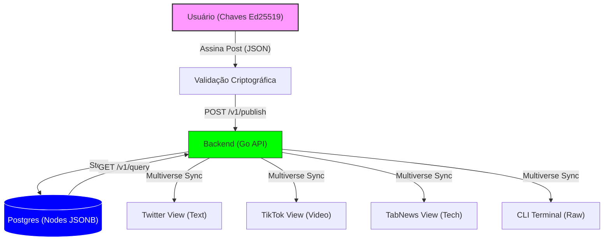
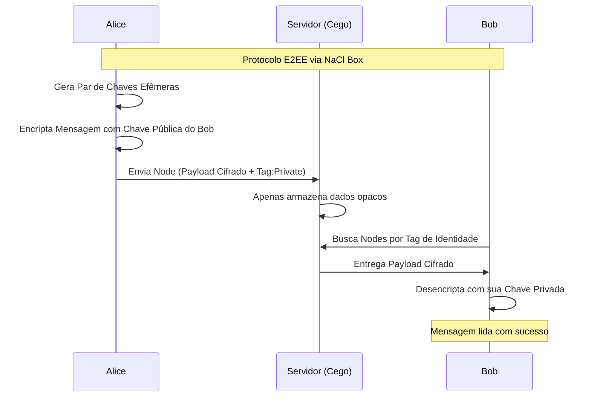

# O Fim dos Silos: Como o Protocolo Crom (meueu) desacopla Dados de Interface

## 1. Introdução: A Era da Soberania de Dados

Nas redes sociais tradicionais, você não é o dono dos seus dados; você é o inquilino de um silo. O Twitter é o dono dos seus tweets, o TikTok é o dono dos seus vídeos e o Instagram é o dono das suas fotos. Se você quiser mudar de "casa", não pode levar seus móveis (dados) nem seus amigos (rede).

O **Crom (meueu)** nasce de uma premissa radicalmente diferente: **Os dados são do usuário, a interface é apenas uma lente.**

Neste protocolo, uma postagem não é apenas um registro em um banco de dados centralizado; é um **Node** assinado criptograficamente por você. Uma vez publicado, esse dado torna-se agnóstico à plataforma. Ele pode ser visualizado como um microblog, um vídeo curto ou um artigo técnico, dependendo apenas da interface que você escolher usar.

---

## 2. Arquitetura Visual: O Fluxo da Informação

A arquitetura do Crom foi desenhada para ser ultraleve e interoperável. O backend em Go atua como um indexador inteligente de objetos JSONB assinados.



---

## 3. O "Multiverso" de Interfaces

A verdadeira magia do Crom reside no fato de que **todos os frontends consomem a mesma API**. Se você publica um vídeo no "TikTok View", ele não fica preso lá. O "Twitter View" verá esse mesmo post, mas o renderizará como um link ou um card de texto, preservando a interoperabilidade.

### [Portão de Entrada] `frontend/index.html`
O ponto de partida onde o usuário escolhe por qual lente deseja observar o protocolo.
![Print: Portal de seleção de interfaces modernas com cards vibrantes]

### [Microblogging] `frontend/twitter.html`
Focado em mensagens rápidas, threads e interações de texto. Ideal para o consumo de notícias e discussões em tempo real.
![Print: Interface estilo Twitter mostrando feed de texto limpo e responsivo]

### [Entertainment] `frontend/tiktok.html`
Scroll infinito de vídeos verticais. Extrai as URLs de vídeo do JSONB e as renderiza em uma experiência imersiva de alta performance.
![Print: Interface estilo TikTok mostrando vídeos verticais ocupando a tela cheia]

### [Technical Reading] `frontend/tabnews.html`
Inspirado na estética do TabNews/Hacker News, prioriza a leitura de artigos longos e discussões técnicas profundas.
![Print: Interface minimalista de alta legibilidade para conteúdos técnicos]

### [Command & Control] `frontend/admin.html`
O painel "God Mode". Onde administradores gerenciam a governança da rede, moderação de conteúdo e monitoramento de nós ativos.
![Print: Painel administrativo com gráficos de uso e controles de moderação]

---

## 4. Segurança e Identidade Soberana

### Login Passwordless (Criptografia de Chave Pública)
No Crom, não existem senhas no lado do servidor. O "Login" é um processo de geração ou importação de chaves **Ed25519** no lado do cliente (browser). 
O servidor nunca vê sua chave privada. Para postar, o cliente gera uma assinatura digital que prova a autoria sem jamais expor o segredo original.

### Mensagens Privadas E2EE (End-to-End Encryption)
O protocolo suporta comunicação nativamente privada através de criptografia de curva elíptica:



---

## 5. Governança e Moderação

Diferente de protocolos puramente anárquicos, o Crom permite **Nodes de Governança**. 
- **SERVER_MODE=WHITELIST**: Permite que o administrador restrinja a publicação apenas a usuários verificados (vitaliciedade vs. spam).
- **ContentFilter**: Um sistema de filtragem que impede a propagação de termos proibidos configurados no Admin.
- **Isolamento**: Cada instância do Crom pode ter suas próprias regras, mas todas podem ler os dados umas das outras se desejarem.

---

## 6. Como Rodar (DevOps)

O projeto é totalmente conteinerizado, garantindo que você possa subir seu próprio nó em segundos.

1. **Clone e Configure**:
   ```bash
   cp .env.example .env
   ```

2. **Segurança do Admin**:
   Gere o hash da sua senha administrativa para o `.env`:
   ```bash
   chmod +x scripts/gen_pass.sh
   ./scripts/gen_pass.sh "sua_senha_secreta"
   ```

3. **Deploy**:
   ```bash
   docker compose up -d --build
   ```

O nó estará disponível em `http://localhost:8080` (ou via proxy reverso Nginx em produção).

---

## 7. Conclusão: O Futuro da Interoperabilidade

O Crom (meueu) não tenta ser apenas mais uma rede social. Ele tenta ser o **tecido conectivo** entre elas. Ao desacoplar o dado da interface, damos ao usuário o poder definitivo: o poder de **escolha**.

Se você não gosta do algoritmo de um frontend, você simplesmente muda de interface, mantendo todos os seus dados e conexões intactos. Este é o alicerce para uma internet mais justa, soberana e resistente à censura.

---
*Escrito pela Equipe de Engenharia do Projeto Crom (meueu)*
